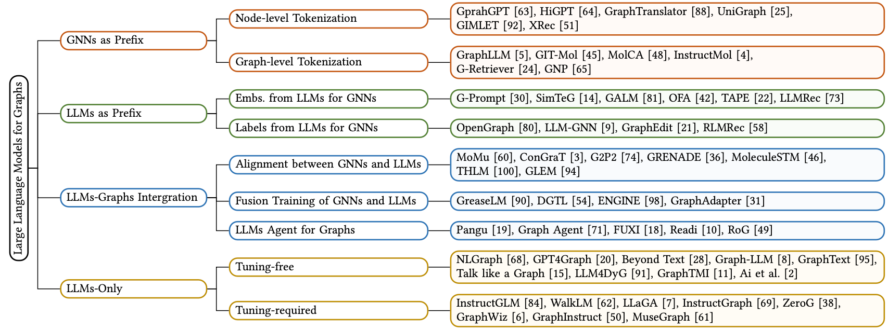

# Awesome-LLM4Graph-Papers

 

A collection of papers and resources about Large Language Models (**LLM**) for Graph Learning (**Graph**).

Graphs are an essential data structure utilized to represent relationships in real-world scenarios. Prior research has established that Graph Neural Networks (GNNs) deliver impressive outcomes in graph-centric tasks, such as link prediction and node classification. Despite these advancements, challenges like data sparsity and limited generalization capabilities continue to persist. Recently, Large Language Models (LLMs) have gained attention in natural language processing. They excel in language comprehension and summarization. Integrating LLMs with graph learning techniques has attracted interest as a way to enhance performance in graph learning tasks.

## News
🤗 We're actively working on this project, and your interest is greatly appreciated! To keep up with the latest developments, please consider hit the **STAR** and **WATCH** for updates.
* Our survey paper: [A Survey of Large Language Models for Graphs]() is coming.