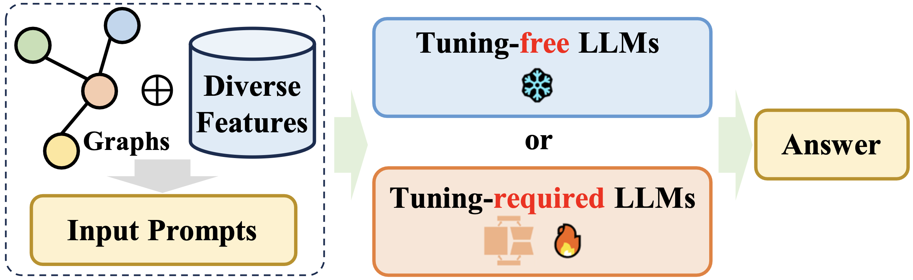

# Awesome-LLM4Graph-Papers
[](https://arxiv.org/abs/2405.08011)
[](https://github.com/HKUDS/Awesome-LLM4Graph-Papers)
 


A collection of papers and resources about Large Language Models (**LLM**) for Graph Learning (**Graph**).

Graphs are an essential data structure utilized to represent relationships in real-world scenarios. Prior research has established that Graph Neural Networks (GNNs) deliver impressive outcomes in graph-centric tasks, such as link prediction and node classification. Despite these advancements, challenges like data sparsity and limited generalization capabilities continue to persist. Recently, Large Language Models (LLMs) have gained attention in natural language processing. They excel in language comprehension and summarization. Integrating LLMs with graph learning techniques has attracted interest as a way to enhance performance in graph learning tasks.

<p align="center">

</p>

## News
🤗 We're actively working on this project, and your interest is greatly appreciated! To keep up with the latest developments, please consider hit the **STAR** and **WATCH** for updates.
* 🚀 Our [LLM4Graph Survey](https://arxiv.org/abs/2405.08011) is accepted by KDD 2024, and we will also give a lecture-style tutorial there!

* 🔥 We gave a [tutorial](https://llm4graph-tutorial.github.io/) on LLM4Graph at TheWebConf (WWW) 2024!

* Our survey paper: [A Survey of Large Language Models for Graphs](https://arxiv.org/abs/2405.08011) is now ready.

## Overview
This repository serves as a collection of recent advancements in employing large language models (LLMs) for modeling graph-structured data. We categorize and summarize the approaches based on four primary paradigms and nine secondary-level categories. The four primary categories include: 1) GNNs as Prefix, 2) LLMs as Prefix, 3) LLMs-Graphs Intergration, and 4) LLMs-Only

- GNNs as Prefix

<p align='center'>

</p>

- LLMs as Prefix

<p align='center'>

</p>

- LLMs-Graphs Intergration

<p align='center'>

</p>

- LLMs-Only

<p align='center'>

</p>

We hope this repository proves valuable to your research or practice in the field of self-supervised learning for recommendation systems. If you find it helpful, please consider citing our work:

```bibtex
@inproceedings{ren2024survey,
  title={A survey of large language models for graphs},
  author={Ren, Xubin and Tang, Jiabin and Yin, Dawei and Chawla, Nitesh and Huang, Chao},
  booktitle={Proceedings of the 30th ACM SIGKDD Conference on Knowledge Discovery and Data Mining},
  pages={6616--6626},
  year={2024}
}

@inproceedings{huang2024large,
  title={Large Language Models for Graphs: Progresses and Directions},
  author={Huang, Chao and Ren, Xubin and Tang, Jiabin and Yin, Dawei and Chawla, Nitesh},
  booktitle={Companion Proceedings of the ACM on Web Conference 2024},
  pages={1284--1287},
  year={2024}
}
```

## Table of Contents
- [Awesome-LLM4Graph-Papers](#awesome-llm4graph-papers)
  - [News](#news)
  - [Overview](#overview)
  - [Table of Contents](#table-of-contents)
  - [Related Resources](#related-resources)
  - [🌐 GNNs as Prefix](#-gnns-as-prefix)
    - [Node-level Tokenization](#node-level-tokenization)
    - [Graph-level](#graph-level)
  - [🌐 LLMs as Prefix](#-llms-as-prefix)
    - [Embs. from LLMs for GNNs](#embs-from-llms-for-gnns)
    - [Labels from LLMs for GNNs](#labels-from-llms-for-gnns)
  - [🌐 LLMs-Graphs Intergration](#-llms-graphs-intergration)
    - [Alignment between GNNs and LLMs](#alignment-between-gnns-and-llms)
    - [Fusion Training of GNNs and LLMs](#fusion-training-of-gnns-and-llms)
    - [LLMs Agent for Graphs](#llms-agent-for-graphs)
  - [🌐 LLMs-Only](#-llms-only)
    - [Tuning-free](#tuning-free)
    - [Tuning-required](#tuning-required)
  - [Contributing](#contributing)
  - [Acknowledgements](#acknowledgements)


## Related Resources
* Large language models on graphs: A comprehensive survey [[paper](https://arxiv.org/pdf/2312.02783)]
* A Survey of Graph Meets Large Language Model: Progress and Future Directions [[paper](https://arxiv.org/pdf/2311.12399)]

## 🌐 GNNs as Prefix
### Node-level Tokenization
- (SIGIR'2024) GraphGPT: Graph instruction tuning for large language models [[paper](https://arxiv.org/pdf/2310.13023)]
- (arxiv'2024) HiGPT: Heterogeneous Graph Language Model [[paper](https://arxiv.org/pdf/2402.16024v1)]
- (WWW'2024) GraphTranslator: Aligning Graph Model to Large Language Model for Open-ended Tasks [[paper](https://arxiv.org/pdf/2402.07197)]
- (arxiv'2024) UniGraph: Learning a Cross-Domain Graph Foundation Model From Natural Language [[paper](https://arxiv.org/pdf/2402.13630v1)]
- (NeurIPS'2024) GIMLET:Aunifiedgraph-textmodelforinstruction-based molecule zero-shot learning [[paper](https://proceedings.neurips.cc/paper_files/paper/2023/file/129033c7c08be683059559e8d6bfd460-Paper-Conference.pdf)]
- (arxiv'2024) XRec: Large Language Models for Explainable Recommendation [[paper](https://arxiv.org/abs/2406.02377)]

### Graph-level 
- (arxiv'2023) GraphLLM: Boosting graph reasoning ability of large language model [[paper](https://arxiv.org/pdf/2310.05845)]
- (Computers in Biology and Medicine) GIT-Mol: A multi-modal large language model for molecular science with graph, image, and text [[paper](https://arxiv.org/pdf/2308.06911)]
- (EMNLP'2023) MolCA: Molecular graph-language modeling with cross- modal projector and uni-modal adapter [[paper](https://arxiv.org/pdf/2310.12798)]
- (arxiv'2023) InstructMol: Multi-modal integration for building a versatile and reliable molecular assistant in drug discovery [[paper](https://arxiv.org/pdf/2311.16208)]
- (arxiv'2024) G-Retriever: Retrieval-Augmented Generation for Textual Graph Understanding and Question Answering [[paper](https://arxiv.org/pdf/2402.07630)]
- (AAAI'2024) Graph neural prompting with large language models [[paper](https://ojs.aaai.org/index.php/AAAI/article/view/29875)]

## 🌐 LLMs as Prefix
### Embs. from LLMs for GNNs
- (arxiv'2023) Prompt-based node feature extractor for few-shot learning on text-attributed graphs [[paper](https://arxiv.org/pdf/2309.02848)]
- (arxiv'2023) SimTeG: A frustratingly simple approach improves textual graph learning [[paper](https://arxiv.org/pdf/2308.02565)]
- (KDD'2023) Graph-aware language model pre-training on a large graph corpus can help multiple graph applications [[paper](https://dl.acm.org/doi/pdf/10.1145/3580305.3599833)]
- (ICLR'2024) One for all: Towards training one graph model for all classification tasks [[paper](https://arxiv.org/pdf/2310.00149)]
- (ICLR'2024) Harnessing explanations: Llm-to-lm interpreter for enhanced text-attributed graph representation learning [[paper](https://openreview.net/pdf?id=RXFVcynVe1)]
- (WSDM'2024) LLMRec: Large language models with graph augmentation for recommendation [[paper](https://arxiv.org/pdf/2311.00423v6)]

### Labels from LLMs for GNNs
- (arxiv'2024) OpenGraph: Towards Open Graph Foundation Models [[paper](https://arxiv.org/pdf/2403.01121)]
- (arxiv'2023) Label-free node classification on graphs with large language models (LLMs) [[paper](https://arxiv.org/pdf/2310.04668)]
- (arxiv'2024) GraphEdit: Large Language Models for Graph Structure Learning [[paper](https://arxiv.org/pdf/2402.15183v1)]
- (WWW'2024) Representation learning with large language models for recommendation [[paper](https://arxiv.org/pdf/2310.15950)]

## 🌐 LLMs-Graphs Intergration
### Alignment between GNNs and LLMs
- (arxiv'2022) A molecular multimodal foundation model associating molecule graphs with natural language [[paper](https://arxiv.org/pdf/2209.05481)]
- (arxiv'2023) ConGraT: Self-supervised contrastive pretraining for joint graph and text embeddings [[paper](https://arxiv.org/pdf/2305.14321)]
- (arxiv'2023) Prompt tuning on graph-augmented low-resource text classification [[paper](https://arxiv.org/pdf/2307.10230)]
- (arxiv'2023) GRENADE: Graph-Centric Language Model for Self-Supervised Representation Learning on Text-Attributed Graphs [[paper](https://arxiv.org/pdf/2310.15109)]
- (Nature Machine Intelligence'2023) Multi-modal molecule structure–text model for text-based retrieval and editing [[paper](https://arxiv.org/pdf/2212.10789)]
- (arxiv'2023) Pretraining language models with text-attributed heterogeneous graphs [[paper](https://arxiv.org/pdf/2310.12580)]
- (arxiv'2022) Learning on large-scale text-attributed graphs via variational inference [[paper](https://arxiv.org/pdf/2210.14709)]

### Fusion Training of GNNs and LLMs
- (ICLR'2022) GreaseLM: Graph reasoning enhanced language models for question answering [[paper](https://arxiv.org/pdf/2201.08860)]
- (arxiv'2023) Disentangled representation learning with large language models for text-attributed graphs [[paper](https://arxiv.org/pdf/2310.18152v3)]
- (arxiv'2024) Efficient Tuning and Inference for Large Language Models on Textual Graphs [[paper](https://arxiv.org/pdf/2401.15569)]
- (WWW'2024) Can GNN be Good Adapter for LLMs? [[paper](https://arxiv.org/pdf/2402.12984v1)]

### LLMs Agent for Graphs
- (ACL'2023) Don't Generate, Discriminate: A Proposal for Grounding Language Models to Real-World Environments[[paper](https://arxiv.org/abs/2212.09736)]
- (arxiv'2022) Graph Agent: Explicit Reasoning Agent for Graphs [[paper](https://arxiv.org/pdf/2310.16421)]
- (arxiv'2024) Middleware for LLMs: Tools Are Instrumental for Language Agents in Complex Environments [[paper](https://arxiv.org/abs/2402.14672)]
- (arxiv'2023) Call Me When Necessary: LLMs can Efficiently and Faithfully Reason over Structured Environments [[paper](https://arxiv.org/pdf/2403.08593)]
- (ICLR'2024) Reasoning on graphs: Faithful and interpretable large language model reasoning [[paper](https://arxiv.org/pdf/2310.01061)]

## 🌐 LLMs-Only (* indicates that VLMs are utilized)
### Tuning-free
- (NeurIPS'2024) Can language models solve graph problems in natural language? [[paper](https://proceedings.neurips.cc/paper_files/paper/2023/file/622afc4edf2824a1b6aaf5afe153fa93-Paper-Conference.pdf)]
- (arxiv'2023) GPT4Graph: Can large language models understand graph structured data? an empirical evaluation and benchmarking [[paper](https://arxiv.org/pdf/2305.15066)]
- (arxiv'2023) BeyondText:ADeepDiveinto Large Language Models’ Ability on Understanding Graph Data [[paper](https://arxiv.org/pdf/2310.04944)]
- (KDD'2024) Exploring the potential of large language models (llms) in learning on graphs [[paper](https://arxiv.org/pdf/2307.03393)]
- (arxiv'2023) Graphtext: Graph reasoning in text space [[paper](https://arxiv.org/pdf/2310.01089)]
- (arxiv'2023) Talk like a graph: Encoding graphs for large language models [[paper](https://arxiv.org/pdf/2310.04560)]
- (arxiv'2023) LLM4DyG:Can Large Language Models Solve Problems on Dynamic Graphs? [[paper](https://arxiv.org/pdf/2310.17110)]
- (arxiv'2023) Which Modality should I use–Text, Motif, or Image?: Understanding Graphs with Large Language Models [[paper](https://arxiv.org/pdf/2311.09862)]
- (arxiv'2023) When Graph Data Meets Multimodal: A New Paradigm for Graph Understanding and Reasoning [[paper](https://arxiv.org/pdf/2312.10372)]

### Tuning-required
- (arxiv'2023) Natural language is all a graph needs [[paper](https://arxiv.org/pdf/2308.07134)]
- (NeurIPS'2024) Walklm:A uniform language model fine-tuning framework for attributed graph embedding [[paper](https://proceedings.neurips.cc/paper_files/paper/2023/file/2ac879d1865475a7abc8dfc7a9c15c27-Paper-Conference.pdf)]
- (NeurIPS'2024) *GITA: Graph to Visual and Textual Integration for Vision-Language Graph Reasoning [[paper](https://arxiv.org/pdf/2402.02130)]
- (arxiv'2024) LLaGA: Large Language and Graph Assistant [[paper](https://arxiv.org/pdf/2402.08170v1)]
- (arxiv'2024) InstructGraph: Boosting Large Language Models via Graph-centric Instruction Tuning and Preference Alignment [[paper](https://arxiv.org/pdf/2402.08785)]
- (arxiv'2024) ZeroG: Investigating Cross-dataset Zero-shot Transferability in Graphs [[paper](https://arxiv.org/pdf/2402.11235)]
- (arxiv'2024) GraphWiz: An Instruction-Following Language Model for Graph Problems [[paper](https://arxiv.org/pdf/2402.16029)]
- (arxiv'2024) GraphInstruct: Empowering Large Language Models with Graph Understanding and Reasoning Capability [[paper](https://arxiv.org/pdf/2403.04483)]
- (arxiv'2024) MuseGraph: Graph-oriented Instruction Tuning of Large Language Models for Generic Graph Mining [[paper](https://arxiv.org/pdf/2403.04780)]
## Contributing
If you have come across relevant resources, feel free to submit a pull request.
```
- (Journal/Confernce'20XX) **paper_name** [[paper](link)]
```

To add a paper to the survey, please consider providing more detailed information in the PR 😊
```
GNNs as Prefix
  - (Node-level Tokenization / Graph-level Tokenization)
LLMs as Prefix
  - (Embs. from LLMs for GNNs / Labels from LLMs for GNNs)
LLMs-Graphs Intergration
  - (Alignment between GNNs and LLMs / Fusion Training of GNNs and LLMs / LLMs Agent for Graphs)
LLMs-Only
  - (Tuning-free / Tuning-required)
Please also consider providing a brief introduction about the method to help us quickly add the paper to our survey :)
```

## Acknowledgements
The design of our README.md is inspired by [Awesome-LLM-KG](https://github.com/RManLuo/Awesome-LLM-KG) and [Awesome-LLMs-in-Graph-tasks](https://github.com/yhLeeee/Awesome-LLMs-in-Graph-tasks), thanks to their works!
